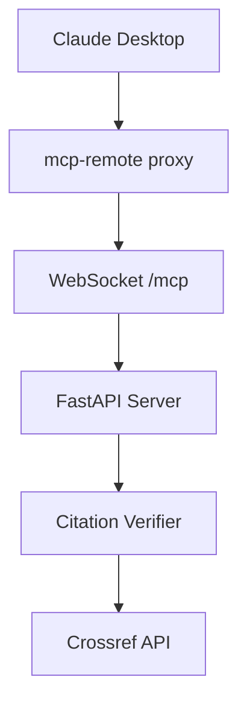

# 🎉 Remote MCP Server Implementation Complete!

## What We Built

You now have a **remote MCP server** similar to the Cloudflare example, but implemented in Python using your existing citation verification logic. Here's what's new:

### 🚀 New Features Added

1. **FastAPI Web Server** (`websocket_server.py`)
   - WebSocket endpoint at `/mcp` for real-time MCP communication
   - HTTP endpoints for health checks and API information
   - CORS support for cross-origin requests
   - Modern async/await pattern with FastAPI lifespan events

2. **Multiple Access Methods**
   - **Local stdio**: Your original `server.py` still works for local Claude Desktop use
   - **Remote WebSocket**: New `websocket_server.py` for remote access
   - **HTTP API**: RESTful endpoints for integration

3. **Easy Deployment Scripts**
   - `start_server.py` - Simple startup script
   - `launch_remote_server.sh` - Full-featured launcher with helpful output
   - Console commands via `pyproject.toml`

4. **Comprehensive Documentation**
   - `REMOTE_SETUP.md` - Detailed deployment and usage guide
   - Updated `README.md` with remote server instructions

### 🛠 How It Works



### 📁 File Structure

```
citation-verifier-mcp/
├── src/citation_verifier_mcp/
│   ├── server.py              # Original stdio MCP server
│   └── websocket_server.py    # NEW: Remote WebSocket server
├── start_server.py            # NEW: Simple startup script
├── launch_remote_server.sh    # NEW: Full-featured launcher
├── REMOTE_SETUP.md           # NEW: Deployment guide
├── README.md                 # Updated with remote info
└── pyproject.toml           # Updated with server dependencies
```

## 🚀 Quick Start

### Start the Remote Server
```bash
# Easy way (shows helpful info):
./launch_remote_server.sh

# Simple way:
uv run python start_server.py

# Console command way:
uv run citation-verifier-remote
```

### Connect Claude Desktop
```json
{
  "mcpServers": {
    "citation-verifier-remote": {
      "command": "npx",
      "args": ["mcp-remote", "ws://localhost:8000/mcp"]
    }
  }
}
```

## 🌐 What Makes This Different from Cloudflare

| Feature | Cloudflare Example | Your Implementation |
|---------|-------------------|-------------------|
| **Language** | TypeScript | Python |
| **Runtime** | Cloudflare Workers | FastAPI + uvicorn |
| **Deployment** | Edge computing | Traditional hosting |
| **Protocol** | SSE primarily | WebSocket + SSE |
| **Logic** | Simple calculator | Real citation verification |
| **Dependencies** | Minimal (edge constraints) | Full Python ecosystem |

## 🎯 Key Benefits

1. **Flexibility**: Deploy anywhere Python runs (not just Cloudflare)
2. **Rich Ecosystem**: Use any Python library for citation verification
3. **Local Development**: Easy testing with `localhost`
4. **Multiple Protocols**: WebSocket for real-time, HTTP for simple requests
5. **Keep Your Code**: Leverages your existing Python citation verification logic

## 🚀 Next Steps

### Immediate
- [x] ✅ Test locally: `./launch_remote_server.sh`
- [x] ✅ Connect Claude Desktop with mcp-remote
- [ ] Test citation verification through the remote interface

### Deployment
- [ ] Choose a cloud provider (Render.com recommended)
- [ ] Deploy your server to production
- [ ] Update Claude Desktop config to use your public URL
- [ ] Share your remote MCP server with others!

### Enhancements
- [ ] Add API key authentication
- [ ] Implement rate limiting
- [ ] Add usage analytics
- [ ] Create a web UI for testing

## 🔧 Troubleshooting

If you have issues:

1. **Check the logs**: The FastAPI server provides detailed logging
2. **Test health endpoint**: `curl http://localhost:8000/health`
3. **Verify WebSocket**: Use `wscat -c ws://localhost:8000/mcp`
4. **Check dependencies**: `uv sync --all-extras`

## 🎉 You Did It!

You've successfully converted your local MCP server into a remote web service that can be accessed by any MCP client over the internet. This opens up many possibilities for sharing and scaling your citation verification tool!

The implementation follows modern Python web development practices while maintaining compatibility with the MCP protocol. You can now deploy this anywhere Python web applications are supported.
